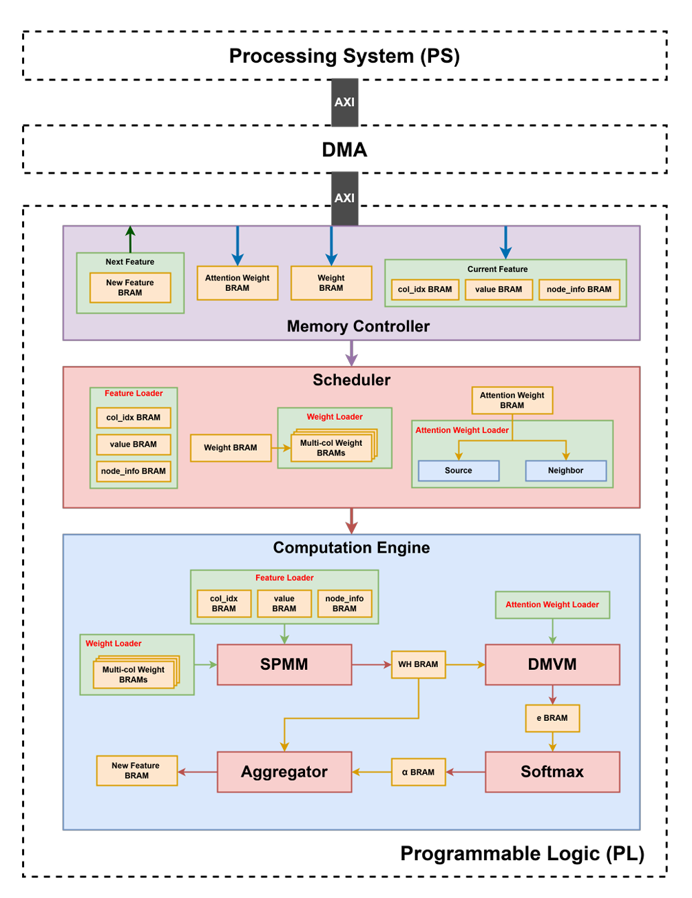

<strong>

HO CHI MINH CITY
UNIVERSITY OF TECHNOLOGY
FACULTY OF COMPUTER SCIENCE AND ENGINEERING
 

 </strong>

**CAPSTONE PROJECT - SEMESTER 241**
 

# Accelerating Graph Attention Network on FPGA

## Overview

This project explores hardware acceleration techniques for **Graph Attention Networks (GAT)**, focusing on FPGA implementation. GAT, a powerful model for graph-structured data, often suffers from high computational demands when applied to large-scale graphs. Our work aims to optimize the key computations of GAT, including Sparse Matrix-Vector Multiplication (SPMM), Dense Matrix-Vector Multiplication (DMVM), and Softmax normalization, for efficient execution on FPGA.

## Objectives

- **Performance Optimization:** Reduce latency and improve throughput for GAT operations using parallel and hardware-efficient designs.
- **Scalable Design:** Create a modular architecture that can handle large graphs and different GAT configurations.
- **Energy Efficiency:** Leverage FPGA's low-power characteristics to minimize energy consumption.
- **Resource Utilization:** Optimize memory usage and computation with custom modules and quantization techniques.

## Key Features

- **Sparse Matrix Handling:** Efficiently processes sparse feature matrices using GCSR format for compact storage and quick access.
- **Parallelized Architecture:** Implements dedicated processing elements (PEs) for parallel computation of GAT's matrix operations.
- **Custom Softmax Algorithm:** Replaces the traditional exponential function \($e^x$\) with \($2^x$\) for hardware efficiency, utilizing bit-shift operations.
- **Dynamic Quantization:** Reduces computation precision to INT8 for efficient processing while maintaining accuracy.
- **Memory Optimization:** Utilizes BRAM for storing intermediate results and minimizes memory access bottlenecks.

## Overall Architecture

## Contributors

- **Hoang Tien Duc**
- **Dang Hoang Gia**
- **Nguyen Duc Bao Huy**

